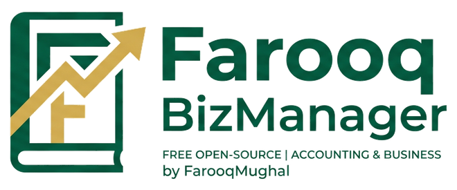
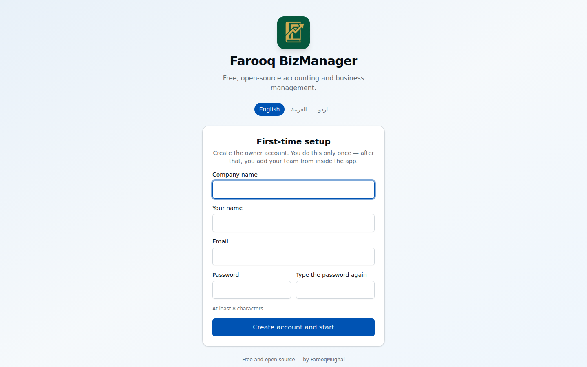
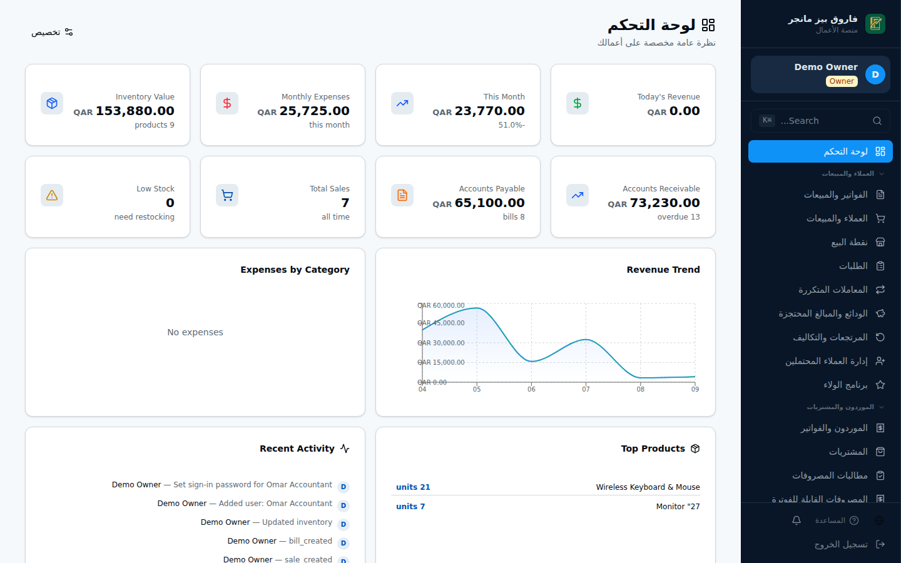
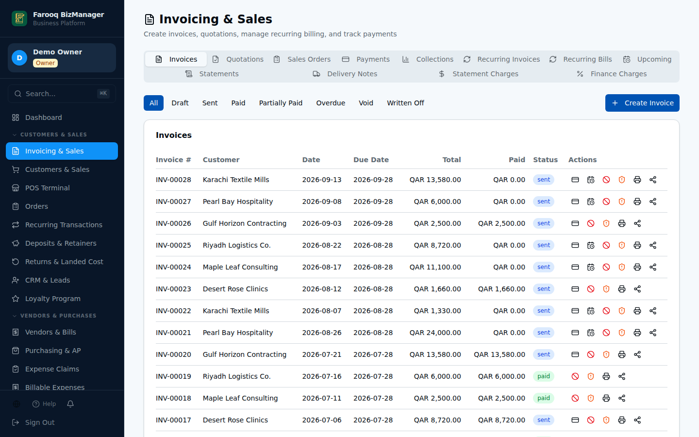
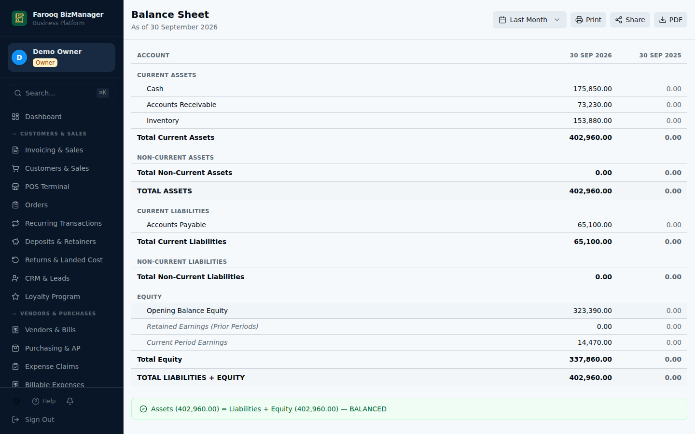
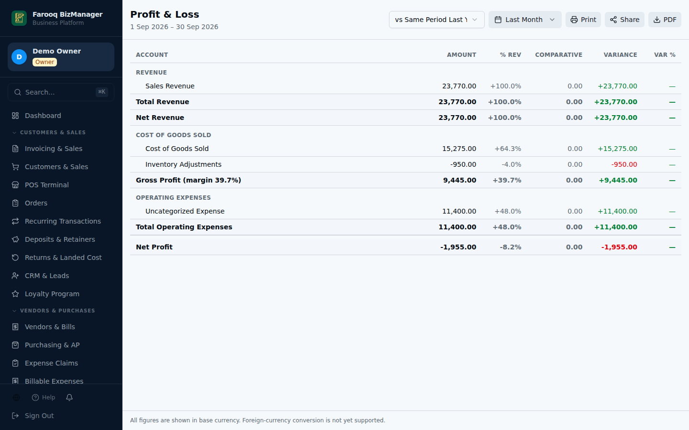
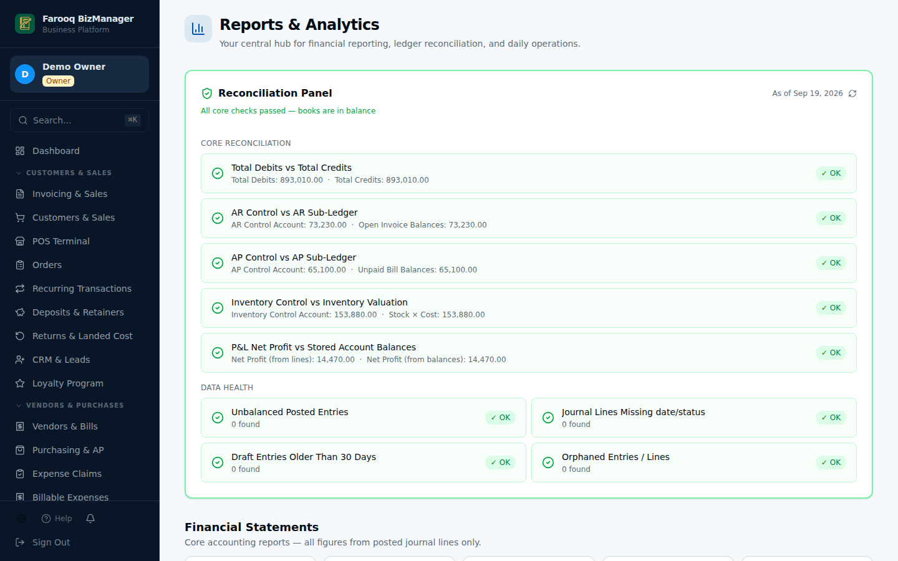
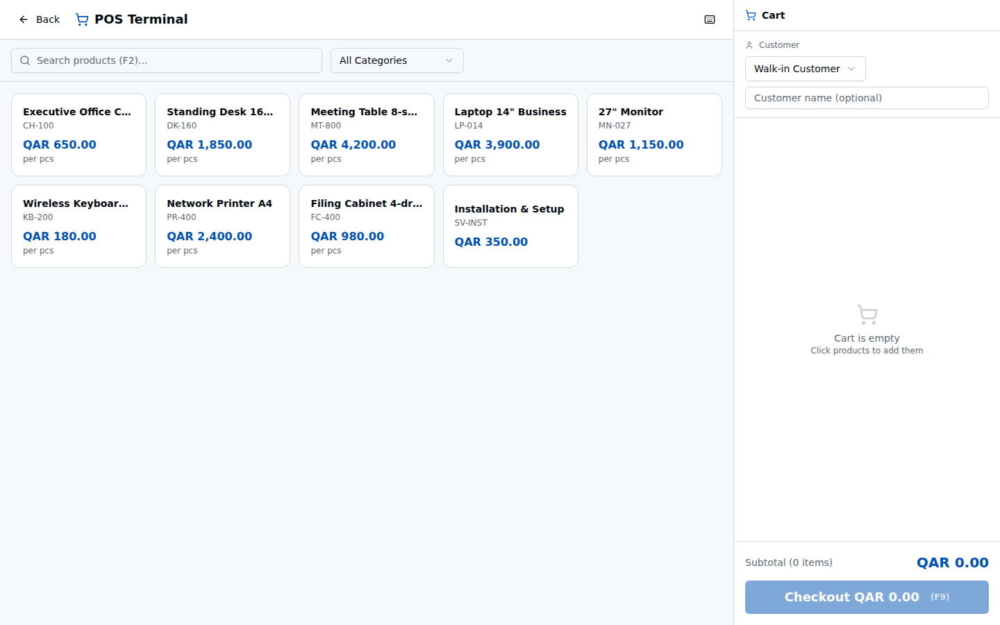
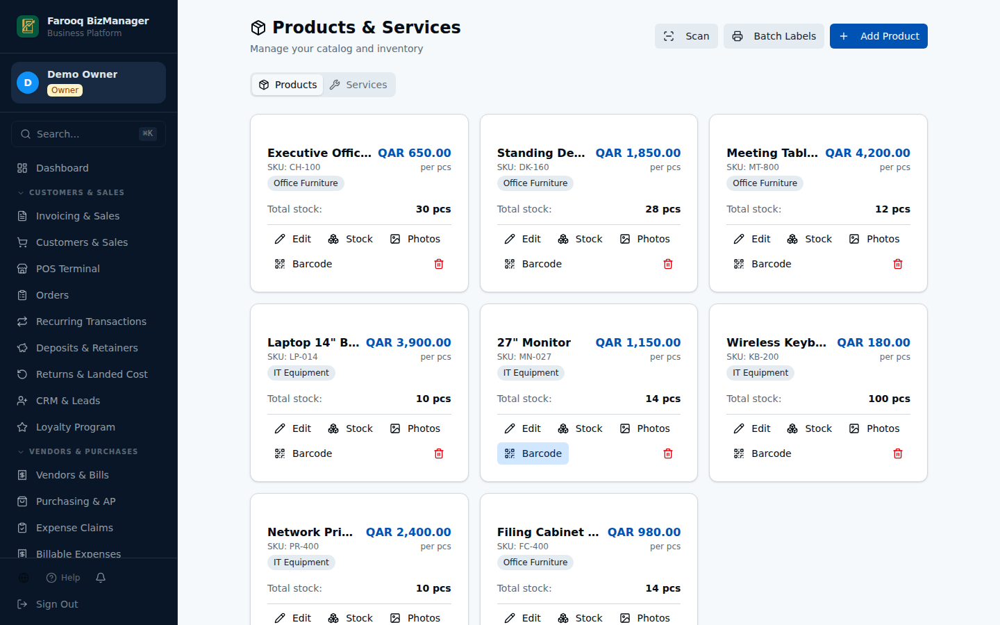

  

  <a href="README.md">English</a> · <a href="README.ur.md">اردو</a> · <b>العربية</b>

برنامج مجاني ومفتوح المصدر للمحاسبة وإدارة الأعمال — بالإنجليزية والأردية والعربية. 
مصمَّم للشركات الصغيرة والمتوسطة في الخليج وباكستان وأمريكا الشمالية.

  

---

## ما هو

فاروق بيز مانجر نظام أعمال متكامل يعمل داخل متصفح الإنترنت.
تثبيت واحد يمنح الشركة المبيعات والفواتير والمخزون والمشتريات والرواتب ومحاسبة كاملة
بالقيد المزدوج — مع تقارير يثق بها المحاسب.

البرنامج **مجاني** دائماً، بموجب رخصة MIT.
يمكنك استخدامه وتعديله ومشاركته والبناء عليه.

صُمِّم انطلاقاً من أكثر من 15 عاماً من الخبرة العملية مع الشركات في قطر وباكستان،
ويُقدَّم هديةً للعالم.

## لمن هو

- المحلات والتجار والموزعون وشركات الخدمات التي تريد حسابات صحيحة دون رسوم شهرية.
- صاحب العمل **غير المتخصص** في الحاسوب: افتح الموقع، أنشئ حسابك، وابدأ العمل.
- المطورون الذين يريدون أساساً محاسبياً متيناً ومختبَراً لبناء منتجاتهم.

## صور من البرنامج

| الإعداد لأول مرة | لوحة التحكم |
|---|---|
|  |  |
| **الفواتير** | **الميزانية العمومية** |
|  |  |
| **الأرباح والخسائر** | **الفحص الذاتي للحسابات** |
|  |  |
| **نقطة البيع** | **المنتجات والمخزون** |
|  |  |

جميع الصور تستخدم بيانات تجريبية وهمية.

## ماذا يفعل

**المبيعات** — العملاء، عروض الأسعار، الفواتير (نقدية وآجلة)، المقبوضات، الإشعارات الدائنة،
المرتجعات، دفعات العملاء المقدمة، الفواتير المتكررة، كشوف الحساب، التذكيرات،
شاشة نقطة البيع، متجر إلكتروني وبوابة خاصة بالعملاء.

**المشتريات** — الموردون، أوامر الشراء، استلام البضائع، فواتير الموردين وسدادها،
أرصدة الموردين الدائنة، الفواتير المتكررة وتكلفة الاستيراد.

**المخزون** — المنتجات والخدمات، عدة مستودعات، وحدات القياس، تنبيهات نقص المخزون،
الجرد الدوري، الباركود، وتقييم المخزون بمتوسط التكلفة.

**المحاسبة** — دفتر أستاذ عام كامل بالقيد المزدوج، دليل الحسابات، قيود اليومية،
حسابات بنكية بعدة عملات، التسوية البنكية، الأصول الثابتة والإهلاك، القروض، الموازنات،
إقفال الفترات وقفل الترحيل.

**الموظفون** — أعضاء الفريق مع الأدوار والصلاحيات، الرواتب، مكافأة نهاية الخدمة،
سُلف الرواتب ومطالبات المصروفات.

**التقارير** — الأرباح والخسائر، الميزانية العمومية، التدفقات النقدية، ميزان المراجعة،
دفتر الأستاذ العام، دفتر اليومية، أعمار الذمم المدينة والدائنة، المبيعات حسب العميل،
سجل التدقيق، منشئ التقارير، و**لوحة المطابقة** التي تفحص الحسابات تلقائياً عند كل فتح.

**وأيضاً** — إدارة علاقات العملاء، المشاريع وتكاليفها، المركبات وتكاليفها، الفروع،
برنامج الولاء، الضمانات، الحقول المخصصة، ومصمم الطباعة لتصميم فاتورتك الخاصة.

## الدول

إعدادات جاهزة (العملة، الضريبة، صيغة التاريخ، أسماء الهويات، السنة المالية) لكل من:

قطر · الإمارات · السعودية · البحرين · الكويت · عُمان ·
باكستان · الهند · مصر · الأردن · الولايات المتحدة · كندا

يمكن تغيير كل إعداد. ويعمل البرنامج في أي دولة أخرى — تكتب العملة ونسب الضريبة بنفسك.

## اللغات

البرنامج بالكامل متاح بـ**الإنجليزية** و**الأردية** و**العربية**،
مع اتجاه من اليمين إلى اليسار للأردية والعربية. يختار كل مستخدم لغته.

## كيف تبدأ

👉 **[دليل التثبيت — خطوة بخطوة](docs/INSTALL.ar.md)**

الطريقة السهلة لا تحتاج إلى برمجة ولا تكلّف شيئاً:
ثلاثة حسابات مجانية، حوالي 20 دقيقة، ويصبح لديك نظام أعمالك الخاص على الإنترنت.

## كيف يعمل من الداخل

| الجزء | ما هو |
|---|---|
| الشاشات | React, TypeScript, Vite, Tailwind CSS |
| الخادم وقاعدة البيانات | [Convex](https://www.convex.dev) — مفتوح المصدر؛ استخدم سحابتهم المجانية أو شغّله بنفسك |
| تسجيل الدخول | مدمج: بريد إلكتروني وكلمة مرور مشفّرة. لا حاجة إلى أي خدمة خارجية |
| البريد الإلكتروني | اختياري. أضف مفتاح [Resend](https://resend.com) المجاني لإرسال التذكيرات والإيصالات |
| الاختبارات | 131 اختباراً تفحص دفتر الأستاذ والتقارير وقواعد تسجيل الدخول |

## ملاحظات بأمانة

- **التحقق بخطوتين** غير متوفر بعد.
- **البريد الإلكتروني** متوقف حتى تضيف المفتاح (راجع دليل التثبيت).
- برنامج المحاسبة يتعامل مع أموال حقيقية. جرّبه ببياناتك قبل الاعتماد عليه، واحتفظ بنسخ احتياطية.
  يُقدَّم البرنامج كما هو دون أي ضمان (راجع الرخصة).

## الرخصة

[MIT](LICENSE) © 2026 FarooqMughal — مجاني للاستخدام والتعديل والمشاركة.

## المؤلف

**محمد فاروق** (FarooqMughal)، الدوحة، قطر.

