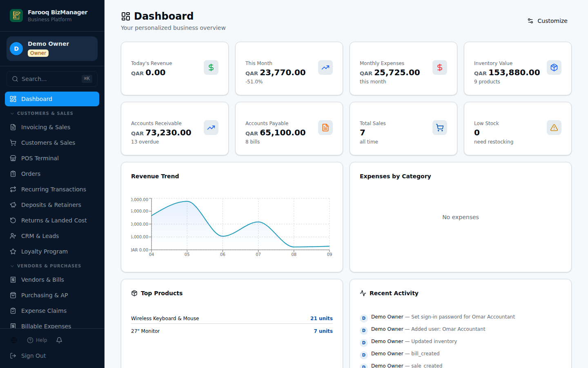
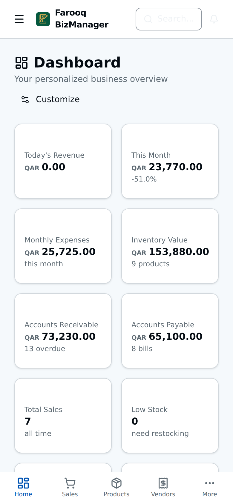

<p align="center">
  
</p>

<p align="center">
  <b>English</b> · <a href="README.ur.md">اردو</a> · <a href="README.ar.md">العربية</a>
</p>

<p align="center">
  Free, open-source accounting and business management — in English, Urdu and Arabic.<br>
  Built for small and medium businesses in the Gulf, Pakistan and North America.
</p>

<p align="center">
  <a href="https://farooq-bizmanager-demo.vercel.app"><b>🟢 Live demo — try it now</b></a> · no sign-up, invented data, reset every night
</p>

<p align="center">
  
</p>

---

## What it is

Farooq BizManager is a complete business system that runs in a web browser. One
installation gives a company its sales, invoices, stock, purchases, payroll and
full double-entry accounting — with reports an accountant can trust.

It is **free**, forever, under the MIT licence. You can use it, change it, give it
to others and build on it.

It was designed from 15+ years of real experience running and supporting
businesses in Qatar and Pakistan, and it is given to the world as a gift.

## Who it is for

- A shop, trader, distributor or service company that wants proper books without paying a monthly fee.
- An owner who is **not** a computer person: you open the website, create your account, and start working.
- Developers who want a solid, tested accounting base to build their own product on.

## Screenshots

| First-time setup | Dashboard |
|---|---|
|  |  |
| **Invoices** | **Balance Sheet** |
|  |  |
| **Profit & Loss** | **Books self-check** |
|  |  |
| **Point of sale** | **Products & stock** |
|  |  |
| **Urdu** | **Arabic** |
|  |  |

<p align="center"> </p>

All screenshots use invented demo data.

## What it does

**Selling** — customers, quotations, invoices (cash and credit), receipts, credit
notes, returns, customer deposits, recurring invoices, statements, reminders, a
point-of-sale screen, an online shop and a customer portal.

**Buying** — vendors, purchase orders, goods receipts, bills, bill payments,
vendor credits, recurring bills and landed cost.

**Stock** — products and services, several warehouses, units of measure,
low-stock alerts, cycle counts, barcodes and inventory valuation at average cost.

**Accounting** — full double-entry general ledger, chart of accounts, journal
entries, bank accounts in several currencies, bank reconciliation, fixed assets
and depreciation, loans, budgets, closing periods and a posting lock.

**People** — team members with roles and permissions, payroll, end-of-service
benefits, salary advances and expense claims.

**Reports** — Profit & Loss, Balance Sheet, Cash Flow, Trial Balance, General
Ledger, Day Book, receivables and payables ageing, sales by customer, audit trail,
a report builder, and a **Reconciliation Panel** that checks the books against
themselves every time you open it.

**Also** — CRM and leads, projects and job costing, vehicles and fleet costs,
branches, loyalty, warranties, custom fields and a print designer for your own
invoice layout.

## Countries

Built-in defaults (currency, tax, date format, ID labels, fiscal year) for:

Qatar · United Arab Emirates · Saudi Arabia · Bahrain · Kuwait · Oman ·
Pakistan · India · Egypt · Jordan · United States · Canada

Every default can be changed. Other countries work too — you set the currency and
tax rates yourself.

## Languages

The whole application is available in **English**, **Urdu** and **Arabic**,
including right-to-left layout for Urdu and Arabic. Each person picks their own
language.

## Getting started

👉 **[Installation guide — step by step, with pictures](docs/INSTALL.md)**
([اردو](docs/INSTALL.ur.md) · [العربية](docs/INSTALL.ar.md))

The easy way needs no programming and costs nothing: three free accounts
(GitHub, Convex, Vercel), about 20 minutes, and you have your own private
business system on the internet.

👉 **[Running it on your own server](docs/SELF-HOSTING.md)** — server, domain,
backups, updates and security ([اردو](docs/SELF-HOSTING.ur.md) · [العربية](docs/SELF-HOSTING.ar.md))

## How it works (for technical readers)

| Part | What it is |
|---|---|
| Screens | React + TypeScript + Vite, Tailwind CSS |
| Server and database | [Convex](https://www.convex.dev) — open source; use their free cloud or run it yourself |
| Sign-in | Built in: email and password, scrypt-hashed, RS256 tokens. No outside login service |
| Email | Optional. Add a free [Resend](https://resend.com) key to send reminders and receipts |
| Tests | Vitest + convex-test, 131 tests covering the ledger, reports and sign-in rules |

Run the tests:

```bash
pnpm install
pnpm test
```

## Honest notes

- **Two-factor sign-in** is not built in yet.
- **Email** is off until you add a key (see the installation guide).
- Accounting software handles real money. Test it with your own data before you
  rely on it, and keep backups. The software is provided as-is, without warranty
  (see the licence).

## Licence

[MIT](LICENSE) © 2026 FarooqMughal — free to use, change and share.

## Author

Created by **Mohammad Farooq** (FarooqMughal), Doha, Qatar.
