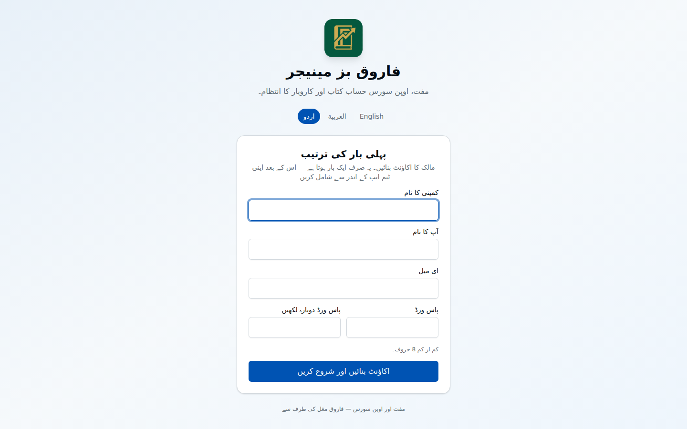
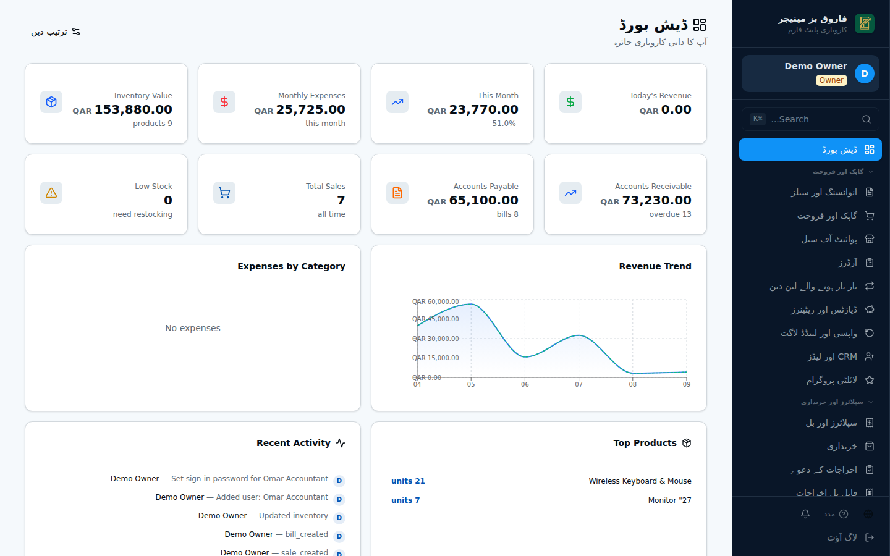
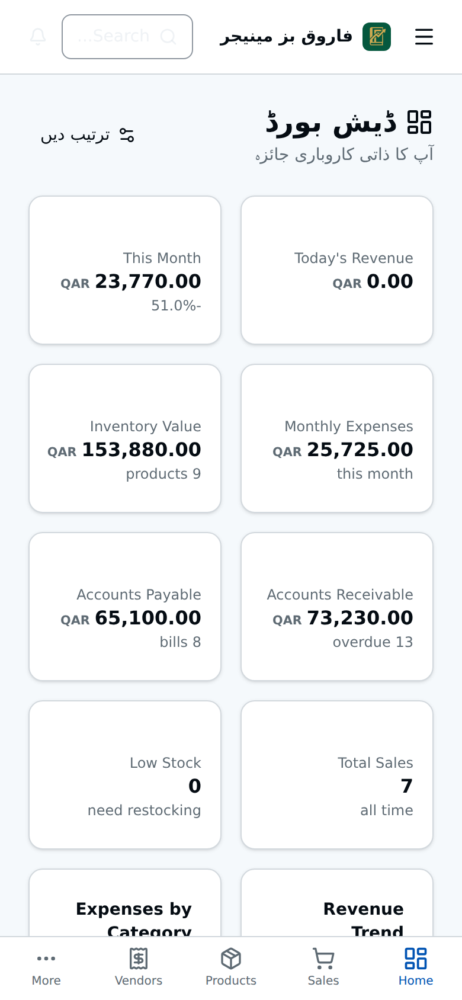

  

  <a href="README.md">English</a> · <b>اردو</b> · <a href="README.ar.md">العربية</a>

مفت اور اوپن سورس حساب کتاب اور کاروبار کا انتظام — انگریزی، اردو اور عربی میں۔ 
خلیجی ممالک، پاکستان اور شمالی امریکہ کے چھوٹے اور درمیانے کاروبار کے لیے۔

  <a href="https://farooq-bizmanager-demo.vercel.app"><b>🟢 چلتا ہوا نمونہ — ابھی آزمائیں</b></a> · کوئی اکاؤنٹ نہیں، فرضی ڈیٹا، ہر رات نیا

  

---

## یہ کیا ہے

فاروق بز مینیجر ایک مکمل کاروباری نظام ہے جو ویب براؤزر میں چلتا ہے۔
ایک تنصیب سے کمپنی کو فروخت، انوائس، اسٹاک، خریداری، تنخواہیں اور مکمل دوہرا اندراج
(ڈبل انٹری) حساب کتاب ملتا ہے — ایسی رپورٹوں کے ساتھ جن پر اکاؤنٹنٹ بھروسا کر سکے۔

یہ ہمیشہ کے لیے **مفت** ہے، MIT لائسنس کے تحت۔
آپ اسے استعمال کر سکتے ہیں، بدل سکتے ہیں، دوسروں کو دے سکتے ہیں اور اس پر اپنا کام بنا سکتے ہیں۔

یہ قطر اور پاکستان میں 15 سال سے زیادہ کے حقیقی کاروباری تجربے سے بنایا گیا ہے،
اور دنیا کو تحفے کے طور پر دیا جا رہا ہے۔

## یہ کس کے لیے ہے

- دکان، تاجر، ڈسٹری بیوٹر یا خدمات والی کمپنی، جو ماہانہ فیس دیے بغیر درست حساب رکھنا چاہے۔
- وہ مالک جو **کمپیوٹر کا ماہر نہیں**: ویب سائٹ کھولیں، اپنا اکاؤنٹ بنائیں، اور کام شروع کریں۔
- وہ ڈویلپر جو اپنا سافٹ ویئر بنانے کے لیے حساب کتاب کی ایک مضبوط، جانچی ہوئی بنیاد چاہتے ہیں۔

## تصویریں

| پہلی بار کی ترتیب | ڈیش بورڈ |
|---|---|
|  |  |
| **انوائس** | **بیلنس شیٹ** |
|  |  |
| **نفع و نقصان** | **حسابات کی خودکار جانچ** |
|  |  |
| **کیشیئر کی اسکرین** | **مصنوعات اور اسٹاک** |
|  |  |

تمام تصویروں میں فرضی نمونہ ڈیٹا ہے۔

## یہ کیا کرتا ہے

**فروخت** — گاہک، قیمت نامے، انوائس (نقد اور ادھار)، وصولیاں، کریڈٹ نوٹ، واپسی،
گاہک کی پیشگی رقم، بار بار کی انوائس، کھاتے کے بیان، یاددہانیاں، کیشیئر کی اسکرین،
آن لائن دکان اور گاہکوں کا اپنا پورٹل۔

**خریداری** — سپلائر، خریداری آرڈر، مال کی وصولی، بل، بلوں کی ادائیگی، سپلائر کریڈٹ،
بار بار کے بل اور درآمدی لاگت۔

**اسٹاک** — مصنوعات اور خدمات، کئی گودام، پیمائش کی اکائیاں، کم اسٹاک کے انتباہ،
گنتی، بارکوڈ، اور اوسط لاگت پر اسٹاک کی قیمت۔

**حساب کتاب** — مکمل ڈبل انٹری جنرل لیجر، کھاتوں کی فہرست، روزنامچہ اندراج،
کئی کرنسیوں میں بینک کھاتے، بینک ملان، مستقل اثاثے اور فرسودگی، قرضے، بجٹ،
مدت کی بندش اور اندراج پر تالا۔

**عملہ** — ٹیم کے ارکان، ان کے کردار اور اجازتیں، تنخواہیں، خدمت کے اختتام کے واجبات،
تنخواہ کی پیشگی اور اخراجات کے دعوے۔

**رپورٹیں** — نفع و نقصان، بیلنس شیٹ، نقدی کا بہاؤ، ٹرائل بیلنس، جنرل لیجر، روزنامچہ،
وصولی اور ادائیگی کی عمر، گاہک وار فروخت، آڈٹ ٹریل، اپنی رپورٹ بنانے کا آلہ،
اور **ملان کا پینل** جو ہر بار کھولنے پر حسابات کو خود جانچتا ہے۔

**مزید** — گاہکوں سے تعلقات (CRM)، منصوبے اور ان کی لاگت، گاڑیاں اور ان کے اخراجات،
شاخیں، وفاداری پروگرام، وارنٹی، اپنی مرضی کے خانے، اور انوائس کا اپنا ڈیزائن بنانے کا آلہ۔

## ممالک

ان ممالک کے لیے پہلے سے ترتیب (کرنسی، ٹیکس، تاریخ کا انداز، شناختی کارڈ کے نام، مالی سال):

قطر · متحدہ عرب امارات · سعودی عرب · بحرین · کویت · عمان ·
پاکستان · بھارت · مصر · اردن · امریکہ · کینیڈا

ہر ترتیب بدلی جا سکتی ہے۔ دوسرے ممالک میں بھی چلتا ہے — کرنسی اور ٹیکس کی شرح آپ خود لکھ دیں۔

## زبانیں

پوری ایپ **انگریزی**، **اردو** اور **عربی** میں ہے،
اور اردو اور عربی میں دائیں سے بائیں ترتیب کے ساتھ۔ ہر شخص اپنی زبان خود چنتا ہے۔

## شروع کیسے کریں

👉 **[تنصیب کی رہنمائی — قدم بہ قدم، تصویروں کے ساتھ](docs/INSTALL.ur.md)**

👉 **[اپنے سرور پر چلانا](docs/SELF-HOSTING.ur.md)** — سرور، ڈومین، بیک اپ، اپڈیٹ اور حفاظت

آسان طریقے میں کوئی پروگرامنگ نہیں اور کوئی خرچ نہیں:
تین مفت اکاؤنٹ، تقریباً 20 منٹ، اور انٹرنیٹ پر آپ کا اپنا نجی کاروباری نظام تیار۔

## یہ پیچھے کیسے چلتا ہے

| حصہ | کیا ہے |
|---|---|
| اسکرینیں | React, TypeScript, Vite, Tailwind CSS |
| سرور اور ڈیٹا بیس | [Convex](https://www.convex.dev) — اوپن سورس؛ ان کا مفت کلاؤڈ استعمال کریں یا خود چلائیں |
| سائن اِن | اندرونی: ای میل اور پاس ورڈ، محفوظ خفیہ شکل میں۔ کسی باہر کی کمپنی کی ضرورت نہیں |
| ای میل | اختیاری۔ یاددہانیاں اور رسیدیں بھیجنے کے لیے [Resend](https://resend.com) کی مفت چابی ڈالیں |
| ٹیسٹ | 131 ٹیسٹ جو لیجر، رپورٹوں اور سائن اِن کے اصولوں کو جانچتے ہیں |

## ایمان داری سے

- **دو مرحلوں والی تصدیق** ابھی موجود نہیں۔
- **ای میل** بند رہتی ہے جب تک آپ چابی نہ ڈالیں (تنصیب کی رہنمائی دیکھیں)۔
- حساب کتاب کا سافٹ ویئر اصلی پیسے سنبھالتا ہے۔ بھروسا کرنے سے پہلے اپنے ڈیٹا سے آزما لیں،
  اور بیک اپ رکھیں۔ یہ سافٹ ویئر جیسا ہے ویسا دیا جا رہا ہے، بغیر کسی ضمانت کے (لائسنس دیکھیں)۔

## لائسنس

[MIT](LICENSE) © 2026 FarooqMughal — استعمال کرنے، بدلنے اور بانٹنے کے لیے مفت۔

## بنانے والا

**محمد فاروق** (FarooqMughal)، دوحہ، قطر۔

