<p align="center"><a href="INSTALL.md">English</a> · <a href="INSTALL.ur.md">اردو</a> · <b>العربية</b></p>

<div dir="rtl">

# تثبيت فاروق بيز مانجر

> 🟢 **جرّبه أولاً:** https://farooq-bizmanager-demo.vercel.app — واضغط **Try the demo**.

هناك ثلاث طرق. اختر واحدة.

| | لمن | التكلفة | الوقت |
|---|---|---|---|
| **أ. السحابة المجانية** (هذه الصفحة) | الجميع. لا حاجة إلى برمجة | مجاني | حوالي 20 دقيقة |
| **ب. خادمك الخاص** ([دليل منفصل](SELF-HOSTING.ar.md)) | فنيو تقنية المعلومات الذين يريدون البيانات على أجهزتهم | خادمك | ساعة إلى ساعتين |
| **ج. وضع المطور** (آخر هذه الصفحة) | المبرمجون الذين يريدون تعديل الكود | مجاني | حوالي 10 دقائق |

---

## كيف يعمل

يتكون فاروق بيز مانجر من جزأين:

1. **الشاشات** — موقع يعمل في المتصفح (حاسوب أو جهاز لوحي أو هاتف). ينشره **Vercel** على الإنترنت مجاناً.
2. **الخادم وقاعدة البيانات** — **[Convex](https://www.convex.dev)**. يحفظ بياناتك وينفّذ كل قواعد المحاسبة. وهو مفتوح المصدر؛ نستخدم هنا سحابته المجانية.

تسجيل الدخول مدمج (بريد إلكتروني وكلمة مرور). لا حاجة إلى أي شركة أخرى.

**قبل البدء:** لا تُدخل أبداً بيانات بطاقة دفع في Convex أو Vercel. في الخطط المجانية لا يمكن خصم أي مبلغ.

---

## أ. السحابة المجانية — خطوة بخطوة، مع الصور

تحتاج إلى ثلاثة حسابات مجانية: GitHub و Convex و Vercel.
سجّل الدخول إلى Convex و Vercel **بحساب GitHub** — فذلك أبسط.

المربعات الحمراء في الصور تشير إلى ما يجب الضغط عليه.

### الخطوة 1 — GitHub: نسختك الخاصة

1. أنشئ حساباً مجانياً في **https://github.com**.
2. افتح **https://github.com/FarooqStars/farooq-bizmanager**
3. اضغط **Fork** ثم **Create fork**. أصبحت لديك نسختك الخاصة.

### الخطوة 2 — Convex: قاعدة بياناتك

1. ادخل إلى **https://www.convex.dev**، سجّل، واختر **Continue with GitHub** ووافق (يقرأ اسمك وبريدك فقط).
2. أنشئ مشروعاً، مثلاً `bizmanager`.
3. يعرض Convex أولاً بيئة **Development**. افتح المحدد الأخضر في الأعلى واختر **Production** بدلاً منها. اختر أقرب منطقة إليك (أوروبا أقرب إلى الخليج وباكستان؛ US East للأمريكيتين) واضغط **Create deployment**.

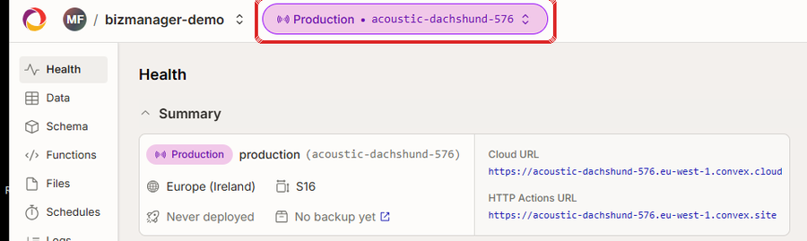

4. اذهب إلى **Settings ← General** وابحث عن **Deploy Keys**. اضغط زر إنشاء **مفتاح نشر للإنتاج**.
5. املأه هكذا:
   - **الاسم:** `vercel`
   - **مدة الصلاحية:** اتركها كما هي
   - **الصلاحيات:** ضع علامة على صلاحية **واحدة فقط**: `deployment:deploy` (أعلى اليسار). **لا** تضغط *Select all*.
   - اضغط **Create**.

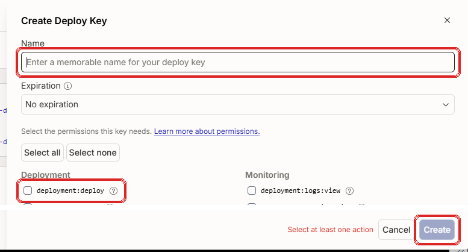

6. **انسخ المفتاح** إلى المفكرة للخطوة التالية. إنه كلمة مرور قاعدة بياناتك: لا تشاركه، لا ترسل صورته، ولا تضعه على GitHub أبداً.

### الخطوة 3 — Vercel: نشر الموقع على الإنترنت

1. ادخل إلى **https://vercel.com/signup**. اختر **المشاريع الشخصية (Hobby)**، واكتب اسماً ثم **Continue with GitHub**.

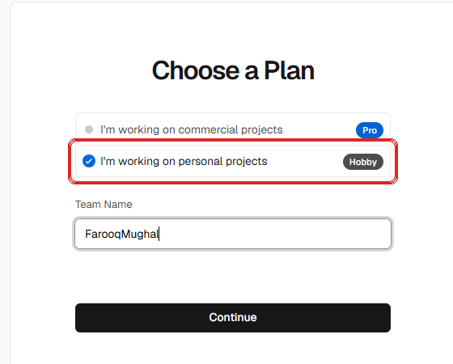

2. اضغط **Add New… ← Project**. سيطلب Vercel تثبيته على GitHub. اختر **Only select repositories** واختر `farooq-bizmanager` فقط. اضغط **Install**.

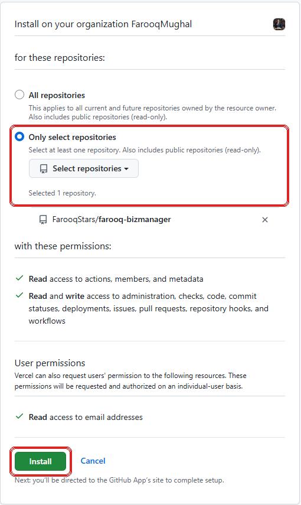

3. بجانب `farooq-bizmanager` اضغط **Import**.
4. في صفحة الإعدادات:
   - **Project Name:** يصبح عنوان موقعك، مثلاً `mycompany-books` ← `mycompany-books.vercel.app`.
   - افتح **Environment Variables** وأضف **Key** باسم `CONVEX_DEPLOY_KEY` و **Value** هو المفتاح من الخطوة 2.
   - **Environments:** غيّرها إلى **Production** فقط. (نسختك عامة؛ هذا يمنع النسخ التجريبية المبنية من اقتراحات الآخرين من استخدام مفتاحك.)
   - لا تغيّر شيئاً آخر — إعدادات البناء الصحيحة موجودة في المشروع.
   - اضغط **Create Project**.

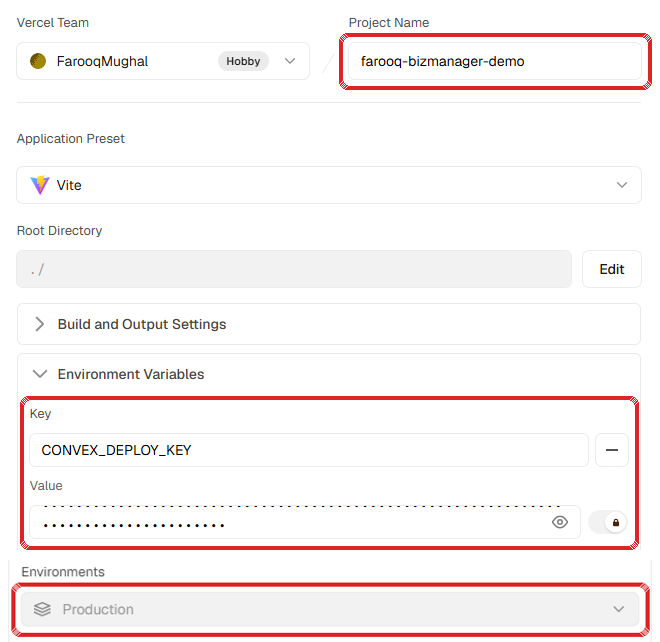

5. اضغط **Deploy**. **لا** تضغط **Add** بجانب *Convex* تحت *Optional Integrations* — فذلك ينشئ قاعدة بيانات ثانية فارغة. قاعدة بياناتك جاهزة.

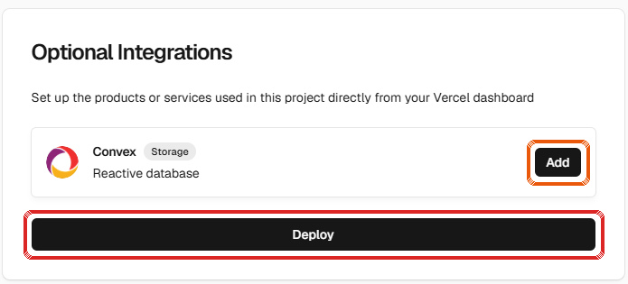

6. قد يقترح Vercel التحقق بخطوتين. فعّله إن كان لديك تطبيق مصادقة على هاتفك؛ وإلا تجاوزه وأضفه لاحقاً.
7. انتظر من 2 إلى 4 دقائق حتى تظهر **Congratulations!**

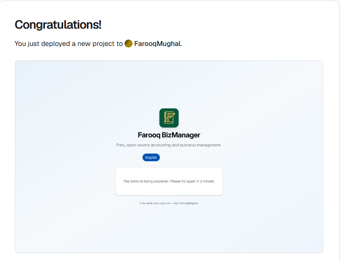

8. اضغط **Continue to Dashboard**. عنوانك يظهر تحت **Domains**. اضغط **Visit**.

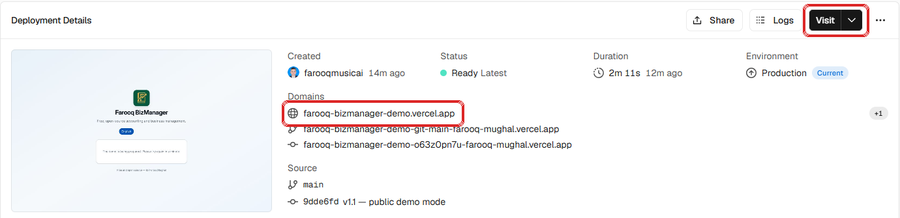

### الخطوة 4 — أنشئ حساب المالك

> ⚠️ افعل ذلك **فوراً**. في التثبيت الجديد، أول من يفتح الموقع يصبح هو المالك.

1. يعرض الموقع نموذج **الإعداد لأول مرة**.
2. اكتب اسم الشركة واسمك وبريدك وكلمة مرور (8 أحرف على الأقل).
3. اضغط **أنشئ الحساب وابدأ**. أنت الآن المالك.


### الخطوة 5 — أول ما تفعله

1. **ملف الشركة** — اختر دولتك. تُملأ العملة والضريبة وصيغة التاريخ والسنة المالية تلقائياً.
2. **المحاسبة ← دليل الحسابات** — استخدم الحسابات الجاهزة أو أضف حساباتك.
3. **المستخدمون والأدوار ← إضافة عضو** — أعطِ كل شخص بريداً وكلمة مرور أولية.
4. أضف المنتجات والعملاء والموردين. يمكن إدخال الرصيد الافتتاحي والمخزون الافتتاحي لكل منها.

احفظ عنوان موقعك في المفضلة. هذا كل شيء.

---

## اختياري: إرسال البريد الإلكتروني

كل شيء يعمل بدونه؛ فقط لا تُرسل الرسائل التلقائية (التذكيرات، الإيصالات، تنبيه نقص المخزون).

1. أنشئ حساباً مجانياً في **https://resend.com**، أضف نطاقك وأنشئ **API key**.
2. في Convex: المشروع ← **Production ← Settings ← Environment Variables** ← **Add**: الاسم `RESEND_API_KEY` والقيمة مفتاحك.

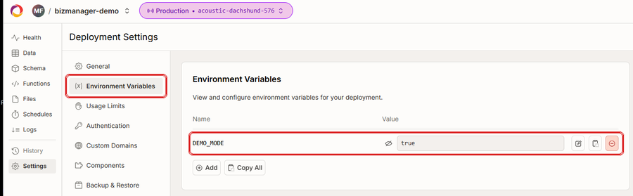

## التحديث إلى إصدار جديد

1. افتح نسختك على GitHub. إن وُجد تحديث سيظهر **Sync fork** ← **Update branch**.
2. يعيد Vercel بناء الموقع تلقائياً. بياناتك لا تُمس.

## نسيت كلمة مرور المالك

أعضاء الفريق: يعيّن المالك كلمة مرور جديدة بزر المفتاح في **المستخدمون والأدوار**.

المالك نفسه: Convex ← المشروع ← **Production ← Functions** ← **authActions ← resetPasswordByEmail**. اضغط **Unlock Edits** (بيئة الإنتاج تطلب ذلك)، وأدخل:

```
{"email": "you@example.com", "newPassword": "a-new-password"}
```

ثم اضغط **Run action**.

## النسخ الاحتياطي

بياناتك في Convex. استخدم **Settings ← Backup & Restore** في لوحة Convex بانتظام واحتفظ بنسخة في مكان آخر. كما تستطيع صفحة **البيانات** في البرنامج تصدير الجداول إلى CSV.

---

## تشغيل نسخة تجريبية عامة (مثل النسخة الرسمية)

ثبّت تماماً كما سبق، ثم:

1. أضف في Convex المتغير `DEMO_MODE` = `true` (الصورة في قسم «إرسال البريد الإلكتروني»).
2. Convex ← **Production ← Functions ← demoActions ← reset**. اضغط **Unlock Edits** ثم **Run action** مع `{}`.

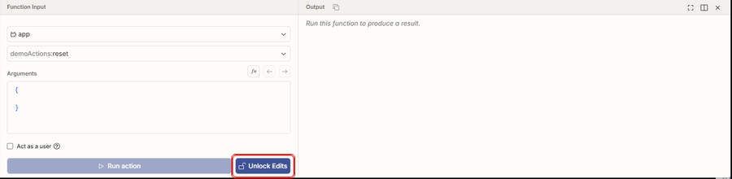

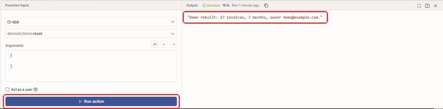

3. افتح موقعك. سيظهر الآن زر **جرّب النسخة التجريبية**:

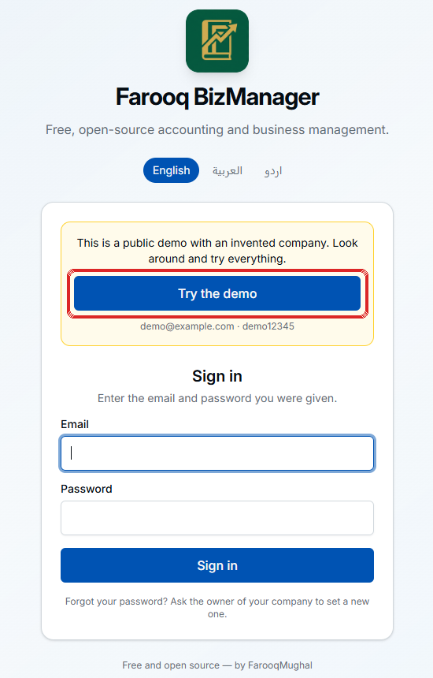

في الوضع التجريبي تُقفل كلمات المرور والأدوار وحذف الأشخاص، ويظهر شريط «نسخة تجريبية عامة» في كل شاشة، ويُمسح كل شيء ويُعاد بناؤه كل ليلة عند 00:00 UTC.
وقبل أول إعادة بناء يعرض الموقع «يجري تجهيز النسخة التجريبية» بدلاً من الإعداد لأول مرة، فلا يستطيع أي زائر أن يجعل نفسه المالك.

**لا تضع `DEMO_MODE` أبداً على تثبيت فيه بيانات حقيقية** — المسح الليلي يحذف كل شيء.

---

## ب. خادمك الخاص

راجع الدليل المنفصل: **[SELF-HOSTING.ar.md](SELF-HOSTING.ar.md)** — الخادم المطلوب، النطاق والاتصال الآمن، النسخ الاحتياطي، التحديث والأمان.

---

## ج. وضع المطور

```bash
git clone https://github.com/FarooqStars/farooq-bizmanager.git
cd farooq-bizmanager
pnpm install
npx convex dev      # ينشئ قاعدة بيانات تطوير ويبقيها متزامنة
pnpm dev            # في نافذة ثانية — http://localhost:5173
pnpm test           # 131 اختباراً
```

| المجلد | المحتوى |
|---|---|
| `convex/` | الخادم: بنية قاعدة البيانات وكل قواعد الأعمال والمحاسبة |
| `convex/lib/ledger.ts` | محرك الترحيل — كل قيد يمر من هنا |
| `convex/authActions.ts` | تسجيل الدخول المدمج |
| `convex/demoActions.ts` | إعادة بناء النسخة التجريبية |
| `convex/__tests__/` | الاختبارات |
| `src/pages/` | مجلد لكل شاشة |
| `src/locales/` | النصوص بالإنجليزية والأردية والعربية |

قاعدة للمساهمين: كل تغيير يحرّك المال يجب أن يرحّل قيداً متوازناً عبر `lib/ledger.ts`، ويحترم قفل الترحيل (`enforcePostingDate`)، ويأتي مع اختبار **يفشل** عند إزالة التغيير.

</div>
